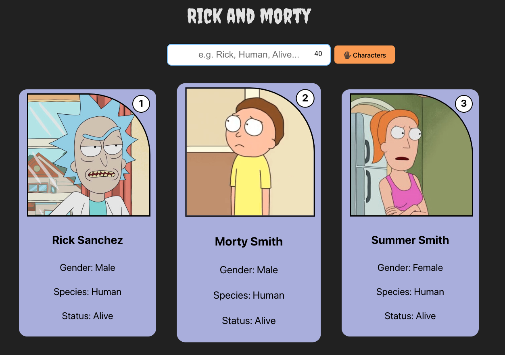

# Rick&Morty-Gallery
Rick&Morty-Gallery is a React project created using Vite and TypeScript. The goal of this project is to fetch data from the Rick and Morty API and store it in a separate TypeScript file. This data is then passed to various components using useState to visualize it.

## Table of contents
- [Overview](#overview)
  - [The challenge](#the-challenge)
  - [Screenshot](#screenshot)
  - [Links](#links)
- [My process](#my-process)
  - [Built with](#built-with)
  - [What I learned](#what-i-learned)
  - [Continued development](#continued-development)
  - [Useful resources](#useful-resources)
- [Author](#author)

## Overview

### The challenge
- Users should be able to enter a character trait (such as name, alive status, etc.) into an input field to filter the list of characters
- If the input field is empty, the entire list should be displayed
- If there are no matches for the input, an error message should be displayed
- The filtered character list should be dynamically updated and displayed as users enter their search term
- Upon clicking a button, display the next 5 characters from a list

### Screenshot

### Links

- Solution URL: [Github Repository](https://github.com/AljoschaNy/learning-react-state-basics)

## My process

### Built with
- [React](https://reactjs.org/) - JS library
- Typescript
- Semantic HTML5 markup
- Flexbox
- CSS Grid

### What I learned
- Creating a React project using Vite and TypeScript
- Fetching data from an external API ([Rick and Morty API](https://rickandmortyapi.com/)) and storing the data in a separate TypeScript file
- Utilizing React Hooks, especially useState, to manage the application state
- Creating components to visualize the fetched data
- Implementing a user input prompt for filtering characters based on user input

### Continued development
In upcoming projects, I'll focus more on mastering React Hooks and improving my ability to efficiently pass data between components for better code organization and functionality.

### Useful resources
- [React Quick Start](https://react.dev/learn#) - This helped me with conditional rendering, rendering lists and using Hooks.

## Author
- Github - [@AljoschaNy](https://github.com/AljoschaNy)
- Frontend Mentor - [@AljoschaNy](https://www.frontendmentor.io/profile/AljoschaNy)
